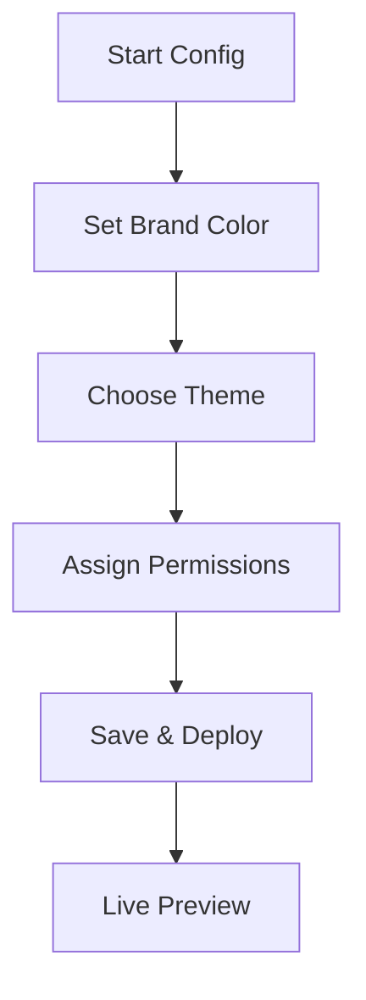

## Overview

Personalize your Ravi Saive Documentation space to match your brand and improve user experience. Configure brand colors, customize themes, and manage access permissions directly from the settings panel. These options help you create a cohesive look and control who views or edits content.

<Callout kind="tip">
  Save changes after each configuration step to see updates live in your documentation.
</Callout>

<Columns cols={3}>
  <Card title="Brand Color" icon="palette" href="#brand-color-setup">
    Set your primary color like `#3B82F6` for instant branding.
  </Card>
  <Card title="Theme Options" icon="moon" href="#theme-customization">
    Switch between light, dark, or custom themes.
  </Card>
  <Card title="Permissions" icon="shield" href="#access-permissions">
    Define roles for viewers, editors, and admins.
  </Card>
</Columns>

## Brand Color Setup

Set your brand color to `#3B82F6` for Ravi Saive Documentation. This updates buttons, links, and accents across all pages.

<Steps>
  <Step title="Access Settings" icon="settings">
    Navigate to **Account > Settings > Branding**.
  </Step>
  <Step title="Enter Color" icon="hash">
    Input your hex code in the **Primary Color** field.
  </Step>
  <Step title="Preview and Save" icon="check-circle">
    Preview changes and click **Apply**.

    <CodeGroup tabs="JSON,CSS">
      ```json
      {
        "brandColor": "#3B82F6",
        "secondaryColor": "#1D4ED8"
      }
      ```
      ```css
      :root {
        --brand-primary: #3B82F6;
        --brand-secondary: #1D4ED8;
      }
      ```
    </CodeGroup>
  </Step>
</Steps>

## Theme Customization

Choose from predefined themes or create custom ones. Use CSS variables for fine-tuned control.

<Tabs>
  <Tab title="Light Theme" icon="sun">
    Ideal for daytime reading.

    ```css
    :root {
      --bg-primary: #FFFFFF;
      --text-primary: #1F2937;
      --brand-accent: #3B82F6;
    }
    ```
  </Tab>
  <Tab title="Dark Theme" icon="moon">
    Reduces eye strain in low light.

    ```css
    :root {
      --bg-primary: #111827;
      --text-primary: #F9FAFB;
      --brand-accent: #60A5FA;
    }
    ```
  </Tab>
  <Tab title="Custom CSS" icon="code">
    Override defaults in your config.

    <Expandable title="Advanced Variables" default-open="false">
      Add these to your theme file:

      ```css
      :root {
        --header-height: 64px;
        --sidebar-width: 280px;
        --border-radius: 8px;
      }
      ```
    </Expandable>
  </Tab>
</Tabs>

<Callout kind="info">
  Themes apply site-wide. Test on multiple devices for consistency.
</Callout>

## Access Permissions

Control who accesses your documentation. Define roles and assign users via the permissions panel.

| Role       | View | Edit | Admin | Description                          |
|------------|------|------|-------|--------------------------------------|
| Viewer     | ✅   | ❌   | ❌    | Read-only access to all pages.      |
| Editor     | ✅   | ✅   | ❌    | Edit content, no settings changes.   |
| Admin      | ✅   | ✅   | ✅    | Full control including user management. |

<Steps>
  <Step title="Invite User" icon="user-plus">
    Go to **Team > Members > Invite**.
  </Step>
  <Step title="Assign Role" icon="shield-check">
    Select role from dropdown and send invite.
  </Step>
  <Step title="Verify Access" icon="eye">
    Ask user to log in and confirm permissions.
  </Step>
</Steps>

## Advanced Configuration

For deeper customization, edit the `config.json` file directly.

<CodeGroup tabs="Full Config,Branding Only">
  ```json
  {
    "theme": {
      "brandColor": "#3B82F6",
      "mode": "auto"
    },
    "permissions": {
      "defaultRole": "viewer",
      "requireLogin": false
    },
    "features": {
      "search": true,
      "analytics": true
    }
  }
  ```
  ```json
  {
    "branding": {
      "primary": "#3B82F6",
      "logo": "/path/to/logo.svg"
    }
  }
  ```
</CodeGroup>



These settings ensure your documentation reflects your brand while maintaining security. Restart your site after config changes for full effect.