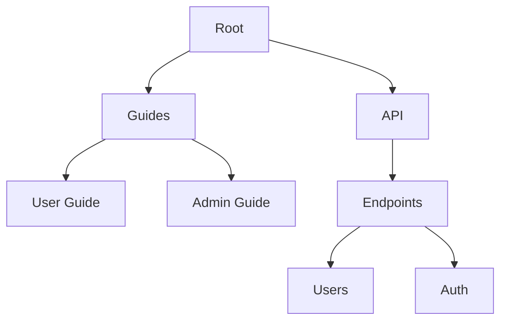

## Overview

Organize your Ravi Saive Documentation space efficiently to keep content accessible and up-to-date. Structure pages hierarchically, format content consistently, and leverage collaboration features to work with your team. Follow these guidelines to maintain a professional documentation site.

<Columns cols={3}>
  <Card title="Page Management" icon="file-text" href="#page-management">
    Create, edit, and organize pages seamlessly.
  </Card>
  <Card title="Content Formatting" icon="type" href="#content-formatting">
    Use Markdown and MDX for rich, interactive content.
  </Card>
  <Card title="Collaboration Tools" icon="users" href="#collaboration-tools">
    Share, review, and merge changes with your team.
  </Card>
</Columns>

## Page Management

Manage pages to create a logical navigation structure. Start by planning your hierarchy with top-level sections like "Getting Started" and "API Reference".

<Steps>
  <Step title="Create a New Page" icon="plus">
    Navigate to your documentation root. Click the "New Page" button and enter a title like `user-guide.mdx`. Add YAML frontmatter immediately:

    ```yaml
    ---
    title: Your Page Title
    description: Brief page summary.
    ---
    ```
  </Step>
  <Step title="Organize Hierarchy" icon="folder">
    Drag pages in the sidebar to nest them under parent folders. For example, place `user-guide.mdx` under a `guides` folder for `/guides/user-guide`.
  </Step>
  <Step title="Publish Changes" icon="upload">
    Preview your page, then commit with a clear message like "Add user guide organization section". Your site updates automatically.
  </Step>
</Steps>

<Callout kind="tip">
  Use descriptive file names and frontmatter titles to improve searchability. Limit nesting to three levels for better navigation.
</Callout>

## Content Formatting

Format content using Markdown for text and MDX components for interactivity. Ensure consistency across pages.

<Tabs>
  <Tab title="Markdown Basics" icon="edit-3">
    Write headings, lists, and tables directly.

    | Element     | Syntax Example                  |
    |-------------|---------------------------------|
    | Heading     | `## H2 Heading`                |
    | Bold        | `**bold text**`                |
    | Inline Code | `` `code` ``                   |
    | Link        | `[Link](https://example.com)`  |

    Always escape special characters like `{variable}` or `<100ms` in prose.
  </Tab>
  <Tab title="MDX Components" icon="code">
    Enhance pages with components like `<Callout>`.

    <CodeGroup tabs="Callout,Steps">
    ```jsx
    <Callout kind="info">
      This is an info callout.
    </Callout>
    ```
    ```jsx
    <Steps>
      <Step title="Step 1">First action.</Step>
    </Steps>
    ```
    </CodeGroup>
  </Tab>
</Tabs>

## Collaboration Tools

Collaborate effectively using built-in version control and review features.

<ExpandableGroup>
  <Expandable title="Version History" default-open="true">
    View changes via the page history panel. Revert to previous versions or compare diffs to track edits.
  </Expandable>
  <Expandable title="Pull Requests">
    Create branches for major updates. Assign reviewers and merge after approval to keep main docs stable.
  </Expandable>
</ExpandableGroup>

<Callout kind="alert">
  Always reference issues with `#123` in commit messages for traceability.
</Callout>



Follow this structure for scalable documentation. Regularly audit pages to remove outdated content and update links. Your organized docs improve user experience and team productivity.